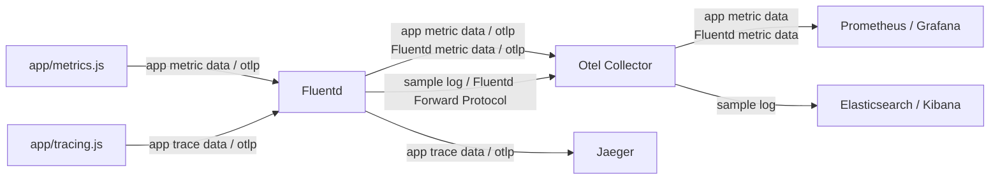
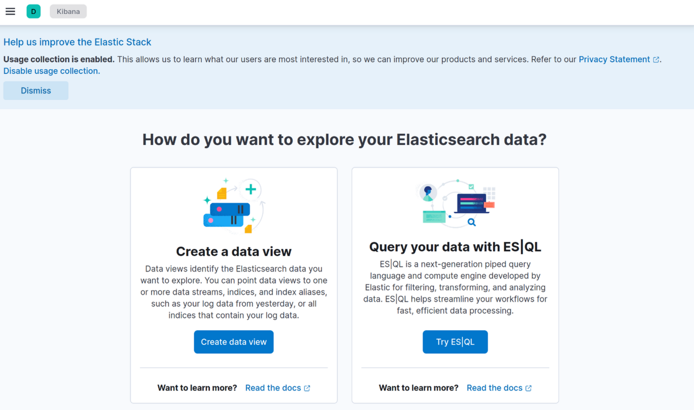
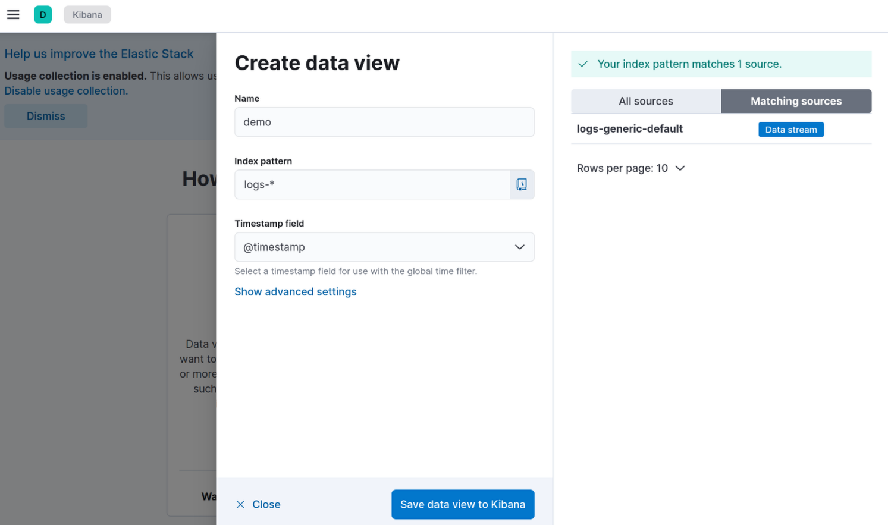
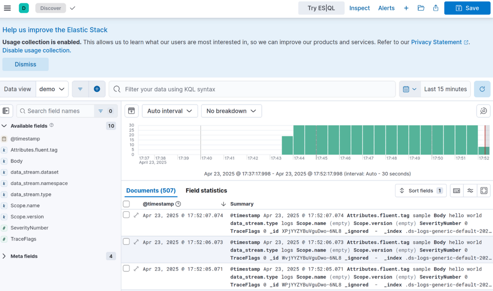

# Fluentd Observability Demo

This is demo based on [fluent-bit-observability-demo](https://github.com/fluent/fluent-bit-observability-demo)
for using Fluentd to export OpenTelemetry traces and metrics.

The telemetry data have been provided by js application in `app` directory.

* metrics.js: OpenTelemetry instrumented application that exports metrics to an endpoint (Fluentd) using the OpenTelemetry protocol
* tracing.js: OpenTelemetry instrumented application that exports trace data to an endpoint (Fluentd) using the OpenTelemetry protocol

### Structure

### Setup

1. Run `docker-compose up -d --build` to start the application

### Visualize metrics data

This demo uses Prometheus / Grafana to visualize the metrics data.

1. Go to [`localhost:3000`](http://localhost:3000) and login to Grafana using credentials admin, admin

2. Then, show `demo > OpenTelemetry` in [dashboard](http://localhost:3000/dashboards).

### Visualize trace data

This demo uses Jaeger to visualize the trace data.

1. Navigate to [`localhost:16686`](http://localhost:16686/), select the correct service and find traces.

### Visualize log data

This demo uses Elasticsearch / Kibana to visualize the trace data.

1. Go to [`http://localhost:5601/app/discover#/`](http://localhost:5601/app/discover#/), then click on `Create data view`.

2. Specify `logs-*` to Index pattern and click Save data view to Kibana.

3. Then, go to Discover tab to check the logs. As you can see, logs are properly collected into the Elasticsearch + Kibana.

